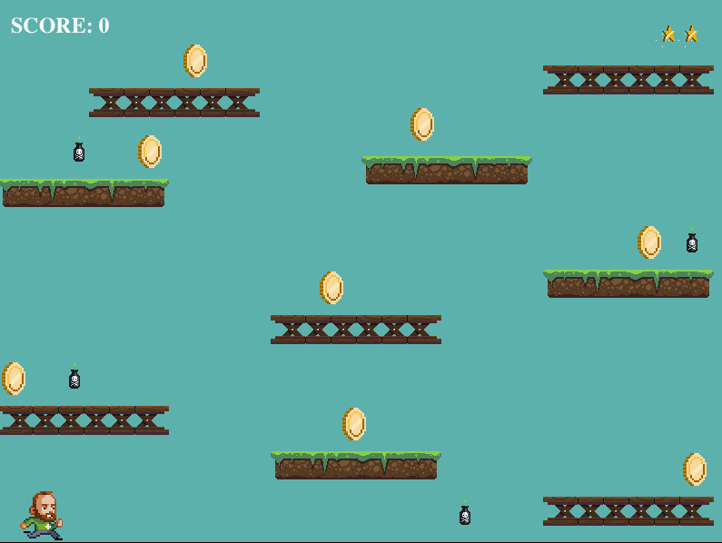

# Coin Collector

A simple Javascript game using phaser. Jump from platform to platform collecting coins.
- Phaser is an open source mobile and descktop HTML5 game framework for Canvas and WebGL browser games. 
- Based on this [tutorial](https://teamtreehouse.com/library/introducing-javascript)

## Install and Play
- Clone repo
- Run webserver on local host port 8080
- Get 100 points to win.  Collect coins to get points, avoid poison, get the stars.
- Press the space bar to jump and move using the arrow keys
- Play and have fun.

 
      
     Coin Collector

## References
- [Phaser Platform](https://phaser.io)
- [Github: Phaser](https://github.com/photonstorm/phaser)
- [Treehouse: Full-Stack Javascript](https://teamtreehouse.com/tracks/full-stack-javascript)
- [Treehouse: Introducing Javascript](https://teamtreehouse.com/library/introducing-javascript)

